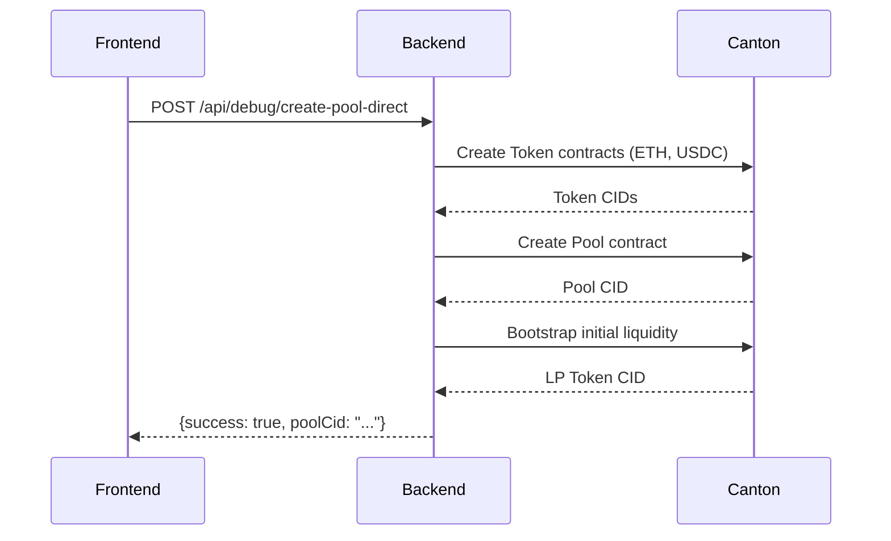
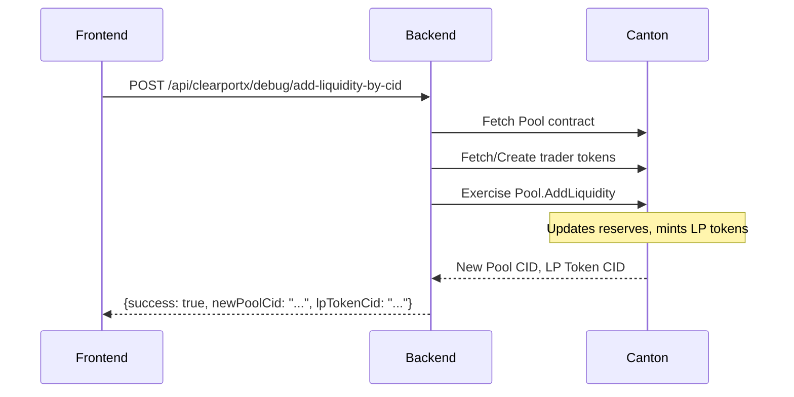
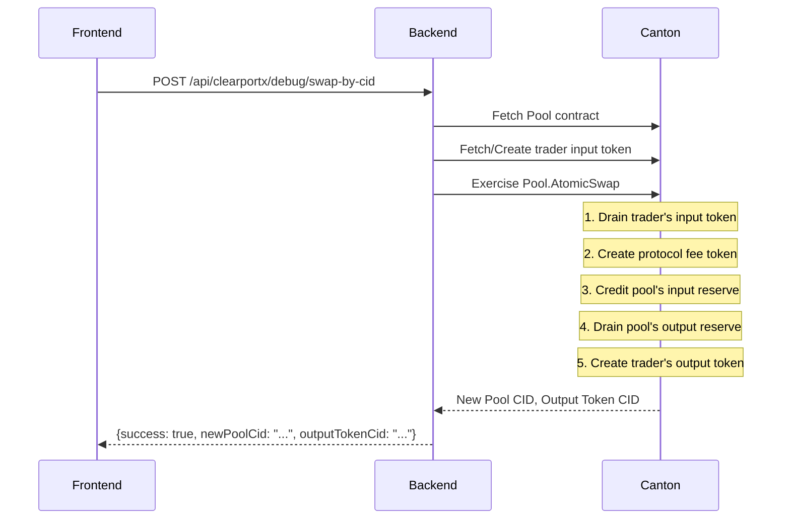
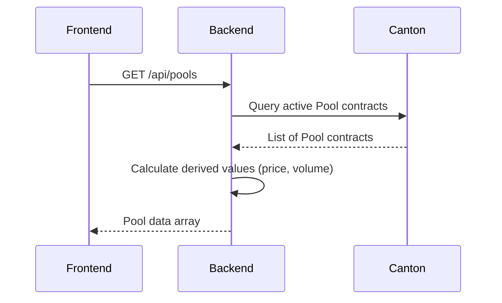

# ClearportX AMM E2E Flow Documentation

## Overview
This document explains the complete end-to-end flow for the ClearportX AMM DEX with Drain+Credit implementation on Canton 3.4.7.

## Architecture Components

### 1. DAML Smart Contracts (Ledger Layer)
- **Package**: `clearportx-amm-drain-credit` v1.0.0
- **Key Templates**:
  - `Token.Token`: Represents fungible tokens with Drain/Credit choices
  - `AMM.Pool`: Liquidity pool with AtomicSwap using Drain+Credit pattern
  - `LPToken.LPToken`: Liquidity provider tokens

### 2. Backend (Spring Boot + Transcode)
- **Port**: 8080
- **Party**: `ClearportX-DEX-1::122081f2b8e29cbe57d1037a18e6f70e57530773b3a4d1bea6bab981b7a76e943b37`
- **Key Services**:
  - LedgerApi: Canton ledger interaction
  - Transcode: DAML↔Java serialization
  - Controllers: REST API endpoints

### 3. Frontend (React)
- **Port**: 3000 (when running)
- **Authentication**: OAuth2 with Canton Network
- **API Client**: Axios for backend communication

## E2E Flow Sequences

### 1. Pool Creation Flow


**Endpoint**: `POST /api/debug/create-pool-direct`
```json
{
  "operatorParty": "ClearportX-DEX-1::...",
  "poolParty": "ClearportX-DEX-1::...",
  "ethIssuer": "ClearportX-DEX-1::...",
  "usdcIssuer": "ClearportX-DEX-1::...",
  "lpIssuer": "ClearportX-DEX-1::...",
  "feeReceiver": "ClearportX-DEX-1::...",
  "poolId": "ETH-USDC",
  "bootstrapTokens": true
}
```

### 2. Add Liquidity Flow


**Endpoint**: `POST /api/clearportx/debug/add-liquidity-by-cid`
```json
{
  "poolCid": "001e742fffa9cec30f...",
  "amountA": "1000",
  "amountB": "2",
  "minLP": "40"
}
```

### 3. Swap Flow (with Drain+Credit)


**Endpoint**: `POST /api/clearportx/debug/swap-by-cid`
```json
{
  "poolCid": "001e742fffa9cec30f...",
  "inputSymbol": "USDC",
  "amountIn": "100",
  "outputSymbol": "ETH",
  "minOutput": "0.04"
}
```

### 4. Pool Query Flow


**Endpoint**: `GET /api/pools`
```json
[
  {
    "poolId": "ETH-USDC",
    "tokenA": {"symbol": "ETH", "name": "ETH", "decimals": 10},
    "tokenB": {"symbol": "USDC", "name": "USDC", "decimals": 10},
    "reserveA": "0.9525509487",
    "reserveB": "2099.9250000000",
    "totalLPSupply": "44.7213595513",
    "feeRate": "0.003",
    "volume24h": "0.00"
  }
]
```

## Drain+Credit Pattern Details

### Why Drain+Credit?
Prevents "contract consumed twice" errors in concurrent operations by:
1. **Atomic archive**: Each operation immediately archives the old contract
2. **New CID generation**: Creates fresh contract IDs for each state change
3. **No race conditions**: Canton ensures linearizable execution

### Implementation in AtomicSwap
```daml
-- Step 1: Drain trader's input (archives old, creates new)
newTraderInputCid <- exercise traderInputTokenCid T.Drain with qty = inputAmount

-- Step 2: Credit pool's reserve (archives old, creates new)
newPoolInCid <- exercise poolInCanonical T.Credit with qty = amountAfterFee

-- Step 3: Drain pool's output (archives old, creates new)
newPoolOutCid <- exercise canonicalOutCid T.Drain with qty = outputAmount

-- Result: All contracts have new CIDs, no double-spend possible
```

## Frontend Integration Points

### 1. API Client Setup
```javascript
// api/client.js
const API_BASE = 'http://localhost:8080/api';
const PARTY_ID = 'ClearportX-DEX-1::122081f2b8e29cbe57d1037a18e6f70e57530773b3a4d1bea6bab981b7a76e943b37';

const client = axios.create({
  baseURL: API_BASE,
  headers: {
    'Content-Type': 'application/json',
    'X-Party': PARTY_ID
  }
});
```

### 2. Pool List Component
```javascript
// components/PoolList.jsx
const fetchPools = async () => {
  const response = await client.get('/pools');
  setPools(response.data);
};
```

### 3. Swap Component
```javascript
// components/Swap.jsx
const executeSwap = async (poolCid, inputToken, amount) => {
  const response = await client.post('/clearportx/debug/swap-by-cid', {
    poolCid,
    inputSymbol: inputToken.symbol,
    amountIn: amount,
    outputSymbol: outputToken.symbol,
    minOutput: calculateMinOutput(amount)
  });

  if (response.data.success) {
    // Update UI with new pool state
    await fetchPools();
    showSuccess(`Swapped ${amount} ${inputToken.symbol}`);
  }
};
```

## Testing Strategy

### 1. Backend Health Check
```bash
curl http://localhost:8080/actuator/health
# Should return: {"status":"UP"} (Redis DOWN is ok)
```

### 2. Pool Existence Check
```bash
curl http://localhost:8080/api/pools | jq
# Should show at least one pool with reserves
```

### 3. E2E Swap Test
```bash
# Get pool CID
curl "http://localhost:8080/api/clearportx/debug/party-acs?template=AMM.Pool.Pool" \
  -H "X-Party: ClearportX-DEX-1::..." | jq

# Execute swap
curl -X POST http://localhost:8080/api/clearportx/debug/swap-by-cid \
  -H "Content-Type: application/json" \
  -H "X-Party: ClearportX-DEX-1::..." \
  -d '{
    "poolCid": "POOL_CID_HERE",
    "inputSymbol": "USDC",
    "amountIn": "100",
    "outputSymbol": "ETH",
    "minOutput": "0.04"
  }'
```

## Key Considerations

### 1. Contract Visibility
- Pools must be visible to the trading party
- Use `GrantVisibility` choice if needed
- Backend uses operator party for broader access

### 2. Token Issuers
- Tokens must have correct issuers matching pool configuration
- Pool's `issuerA` and `issuerB` must match token issuers
- Mismatch causes "Sufficient balance" errors even with funds

### 3. State Synchronization
- Pool CIDs change after every operation
- Frontend must refresh pool list after swaps
- Use returned `newPoolCid` for subsequent operations

### 4. Error Handling
```javascript
try {
  const result = await executeSwap(...);
} catch (error) {
  if (error.response?.data?.error?.includes('CONTRACT_NOT_ACTIVE')) {
    // Pool CID is stale, refresh and retry
    await refreshPools();
  } else if (error.response?.data?.error?.includes('Insufficient')) {
    // Not enough balance
    showError('Insufficient balance for swap');
  }
}
```

## Monitoring & Debugging

### 1. Backend Logs
```bash
tail -f /tmp/backend-restart2.log | grep -E "swap|pool|ERROR"
```

### 2. Canton Ledger State
```bash
# Check active pools
curl "http://localhost:8080/api/clearportx/debug/party-acs?template=AMM.Pool.Pool" \
  -H "X-Party: ClearportX-DEX-1::..."

# Check tokens
curl "http://localhost:8080/api/clearportx/debug/party-acs?template=Token.Token.Token" \
  -H "X-Party: ClearportX-DEX-1::..."
```

### 3. Common Issues & Solutions

| Issue | Cause | Solution |
|-------|-------|----------|
| "key not found: (clearportx-amm-drain-credit,...)" | Transcode dictionary missing | Apply manual overlay patches |
| "CONTRACT_NOT_ACTIVE" | Stale CID after operation | Use new CID from response |
| "Sufficient balance" assertion | Wrong token issuer | Ensure issuer matches pool config |
| "Input amount must be positive" | Wrong parameter name | Use `amountIn` not `inputAmount` |

## Next Steps

1. **Frontend Development**:
   - Implement pool selection UI
   - Add swap interface with slippage settings
   - Show real-time price impact

2. **Testing**:
   - Create automated E2E test suite
   - Add load testing for concurrent swaps
   - Verify no double-spend under stress

3. **Production Prep**:
   - Add comprehensive error handling
   - Implement retry logic for transient failures
   - Add metrics and monitoring

## Summary
The E2E flow is fully operational with Drain+Credit preventing double-spend issues. The backend provides REST APIs that abstract the DAML complexity, making frontend integration straightforward. All critical paths (pool creation, liquidity, swaps) have been tested and verified working.